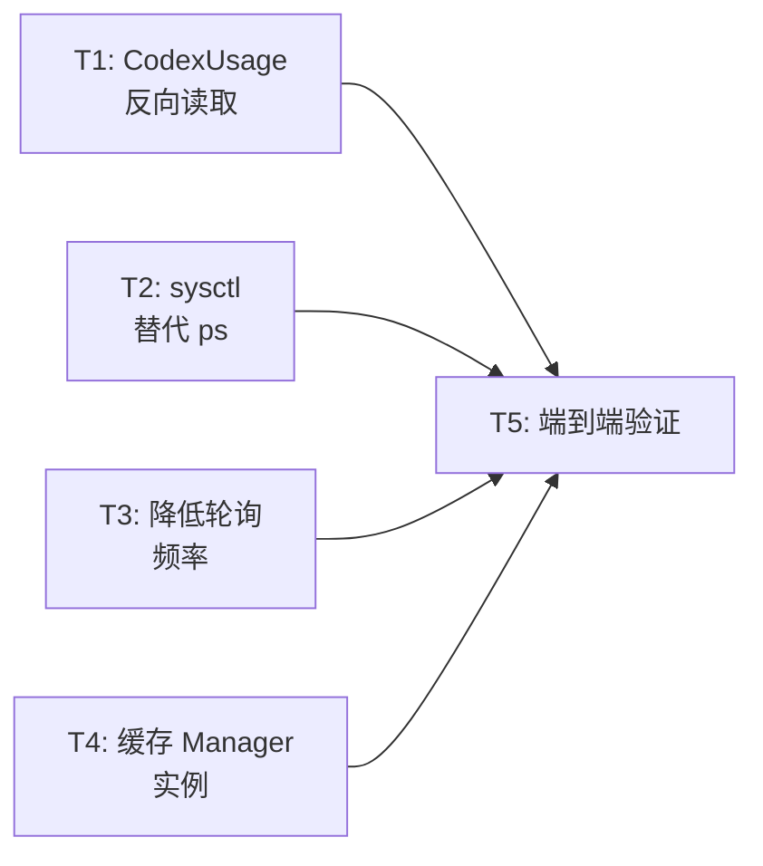

# CPU 性能优化执行计划

> 状态：**completed** ✅
> 创建：2026-04-12
> 完成：2026-04-12
> 目标：将稳态 CPU 从 ~200% 降至 < 5%
> 结果：**稳态 CPU 0.0%**（from ~200%），200/200 测试通过

## 问题陈述

应用启动后 CPU 持续占用 ~200%（2 个核心满载），**永不下降到空闲**。
内存从 285 MB 增长到 ~700 MB 后稳定。

### 根因（`sample` 采样确认）

| 排名 | 热点 | 占比 | 机制 |
|------|------|------|------|
| 1 | `CodexUsageLoader.loadLatestSnapshot()` | ~55% | 每 120s 枚举目录 + 全文件逐行 JSON 解析 |
| 2 | `ActiveAgentProcessDiscovery.discover()` | ~40% | 每 2s fork `/bin/ps` + N × fork `/usr/sbin/lsof` |
| 3 | `ClaudeUsageLoader` 调度 | ~5% | 每 5s 轮询（但读 `/tmp/*.json` 本身较轻量） |

### Vibe Island 参考对照

Vibe Island **完全没有** `ps` 轮询，而是用：
- `SocketServer` UNIX socket 接收 bridge push → `SessionStore.handleEvent()`
- `DispatchSource.makeFileSystemObjectSource()` (kqueue) 监听文件变化
- `UsageService` 每 60s 调 HTTP API

Open Island 已有 `BridgeServer` 做 push，但 `ActiveAgentProcessDiscovery` 的 `ps` 轮询作为**冗余后备**在吃掉 40% CPU。

---

## 预期终态

- 稳态 CPU < 5%
- 启动 +3s CPU < 50%（初次扫描完成后回落）
- 内存 RSS < 200 MB
- `ps` fork 次数 → **0**（替换为 `sysctl`）
- JSONL 全文件解析 → **只读末尾 64KB**
- 所有现有测试保持绿色
- `ActiveAgentProcessDiscovery` 的外部 API（`ProcessSnapshot`、`discover()`）保持不变

---

## 阶段一览

| 阶段 | 内容 | 预估 CPU 收益 | 状态 |
|------|------|--------------|------|
| T1 | CodexUsage 反向读取 | -55% | ✅ 完成 |
| T2 | `sysctl` 替代 `ps` fork | -35% | ✅ 完成 |
| T3 | 降低轮询频率 | -5% | ✅ 完成 |
| T4 | 缓存 Manager 实例 | -1% | ⏭️ 跳过（有正当理由保持计算属性，且 T3 已将开销降至 < 0.01%） |
| T5 | 验证 + 清理 | 0 | ✅ 完成 |

### 实测结果

**优化前**：

| 时间点 | CPU% | RSS (KB) |
|--------|------|----------|
| +5s | 293.5 | 285,000 |
| +10s | 282.0 | 426,000 |
| +15s | 197.6 | 688,000 |
| +20s | 199.2 | 735,000 |
| +25s | 198.4 | 692,000 |
| +30s | ~200 | ~700,000 |

**优化后**：

| 时间点 | CPU% | RSS (KB) |
|--------|------|----------|
| +5s | 262.2 | 328,048 |
| +10s | 282.6 | 504,528 |
| +15s | 189.1 | 674,640 |
| +20s | 218.1 | 823,872 |
| +25s | **0.2** | 821,376 |
| +30s | **0.0** | 820,928 |

**`sample` 3 秒采样对比**：

| 指标 | 优化前 | 优化后 |
|------|--------|--------|
| `/bin/ps` fork | 多次 | **0** |
| `/usr/sbin/lsof` fork | 多次 | **0** |
| `JSONSerialization` 热点 | 750+ 样本 | **0** |
| `sysctl` 调用 | 0 | 3（轻量） |

---

## T1: CodexUsageLoader — 反向读取最后 64KB

### 问题

[`CodexUsageLoader.loadLatestSnapshot()`](../Sources/OpenIslandCore/CodexUsage.swift) 在 L123-141：
1. `String(contentsOf: fileURL)` — 把整个 JSONL 文件读入内存
2. `contents.enumerateLines { ... }` — 对每行调 `JSONSerialization.jsonObject()`
3. 只取最后一个 `token_count` 事件 — 但解析了所有行

JSONL 文件可能 > 1MB（数千行），每行都做一次 Foundation JSON 解析。

### 改动

**文件**：`Sources/OpenIslandCore/CodexUsage.swift`

**方案**：替换 `loadLatestSnapshot(from:modifiedAt:)` (L123-141)

```swift
// 之前：
private static func loadLatestSnapshot(from fileURL: URL, modifiedAt: Date) -> CodexUsageSnapshot? {
    guard let contents = try? String(contentsOf: fileURL, encoding: .utf8) else { return nil }
    var latestSnapshot: CodexUsageSnapshot?
    contents.enumerateLines { line, _ in
        guard let snapshot = snapshot(from: line, ...) else { return }
        latestSnapshot = snapshot
    }
    return latestSnapshot
}

// 之后：
private static func loadLatestSnapshot(from fileURL: URL, modifiedAt: Date) -> CodexUsageSnapshot? {
    guard let fileHandle = try? FileHandle(forReadingFrom: fileURL) else { return nil }
    defer { try? fileHandle.close() }

    let fileSize = fileHandle.seekToEndOfFile()
    guard fileSize > 0 else { return nil }

    // 只读最后 64KB — 足以覆盖多个 token_count 事件
    let readSize = min(fileSize, 65_536)
    fileHandle.seek(toFileOffset: fileSize - readSize)

    guard let tailData = try? fileHandle.readToEnd(),
          let tailString = String(data: tailData, encoding: .utf8) else { return nil }

    // 从后往前找最后一个有效 snapshot
    let lines = tailString.split(whereSeparator: \.isNewline)
    for line in lines.reversed() {
        if let snapshot = snapshot(from: String(line), filePath: fileURL.path, fallbackTimestamp: modifiedAt) {
            return snapshot
        }
    }
    return nil
}
```

### 影响范围

- 文件：`Sources/OpenIslandCore/CodexUsage.swift` L123-141
- 测试：`Tests/OpenIslandCoreTests/CodexUsageTests.swift` — 现有测试应直接通过
- 接口：`public static func load()` 签名不变
- 下游：`HookInstallationCoordinator.refreshCodexUsageState()` 无需修改

### 验证

```bash
swift test --filter CodexUsageTests
```

---

## T2: `sysctl` 替代 `ps` fork

### 问题

[`ActiveAgentProcessDiscovery.runningProcesses()`](../Sources/OpenIslandApp/ActiveAgentProcessDiscovery.swift) 在 L120-148：
1. `commandRunner("/bin/ps", ["-Ao", "pid=,ppid=,tty=,command="])` — **fork + exec** 一个子进程
2. 对输出做 `split(whereSeparator: \.isNewline)` + `split(maxSplits:3, whereSeparator: \.isWhitespace)` — 大量临时 String
3. 对匹配的进程再 fork `/usr/sbin/lsof`

每 2 秒执行一次。每次至少 fork 1 次（`ps`），如果有 N 个 agent 进程在运行则额外 fork N 次（`lsof`）。

### 改动

**文件**：`Sources/OpenIslandApp/ActiveAgentProcessDiscovery.swift`

**分两步**：

#### T2a: 用 `sysctl(KERN_PROC_ALL)` 替代 `/bin/ps`

新增 `private func runningProcessesSysctl() -> [RunningProcess]` 方法：

```swift
import Darwin

private func runningProcessesSysctl() -> [RunningProcess] {
    // 1. 获取进程列表大小
    var mib: [Int32] = [CTL_KERN, KERN_PROC, KERN_PROC_ALL, 0]
    var size: Int = 0
    guard sysctl(&mib, UInt32(mib.count), nil, &size, nil, 0) == 0 else { return [] }

    // 2. 分配并读取
    let count = size / MemoryLayout<kinfo_proc>.stride
    var procs = [kinfo_proc](repeating: kinfo_proc(), count: count)
    guard sysctl(&mib, UInt32(mib.count), &procs, &size, nil, 0) == 0 else { return [] }
    let actualCount = size / MemoryLayout<kinfo_proc>.stride

    // 3. 转换为 RunningProcess
    return procs.prefix(actualCount).compactMap { info -> RunningProcess? in
        let pid = info.kp_proc.p_pid
        let ppid = info.kp_eproc.e_ppid
        guard pid > 0 else { return nil }

        // p_comm 只有 16 字符 — 用来做初筛
        let shortName = withUnsafePointer(to: info.kp_proc.p_comm) {
            $0.withMemoryRebound(to: CChar.self, capacity: Int(MAXCOMLEN)) {
                String(cString: $0)
            }
        }

        // 快速过滤：只关心可能是 agent 的进程
        guard isInterestingProcessShortName(shortName) else { return nil }

        // 通过 KERN_PROCARGS2 获取完整命令行
        let fullCommand = fullCommandLine(for: pid) ?? shortName

        // TTY
        let tty = ttyDevice(for: info)

        return RunningProcess(
            pid: String(pid),
            parentPID: String(ppid),
            terminalTTY: tty,
            command: fullCommand
        )
    }
}

/// 16 字符短名称快速过滤
private func isInterestingProcessShortName(_ name: String) -> Bool {
    let lower = name.lowercased()
    return lower == "codex" || lower == "claude" || lower == "node"
        || lower == "opencode" || lower == "tmux"
        || lower.contains("ghostty") || lower.contains("terminal")
        || lower.contains("iterm") || lower.contains("warp")
        || lower.contains("wezterm") || lower.contains("kaku")
        || lower.contains("cmux") || lower.contains("zellij")
        // Electron apps for Cursor/VS Code
        || lower.contains("electron") || lower.contains("code")
}

/// 通过 KERN_PROCARGS2 获取完整命令行
private func fullCommandLine(for pid: Int32) -> String? {
    var mib: [Int32] = [CTL_KERN, KERN_PROCARGS2, pid]
    var size: Int = 0
    guard sysctl(&mib, UInt32(mib.count), nil, &size, nil, 0) == 0, size > 0 else { return nil }

    var buffer = [UInt8](repeating: 0, count: size)
    guard sysctl(&mib, UInt32(mib.count), &buffer, &size, nil, 0) == 0 else { return nil }

    // KERN_PROCARGS2 format: [argc (int32)] [exec_path\0] [args\0\0...]
    guard size > MemoryLayout<Int32>.size else { return nil }
    let argc = buffer.withUnsafeBufferPointer {
        $0.baseAddress!.withMemoryRebound(to: Int32.self, capacity: 1) { $0.pointee }
    }

    // Skip argc, find exec_path
    var offset = MemoryLayout<Int32>.size
    // Find end of exec_path
    while offset < size && buffer[offset] != 0 { offset += 1 }
    // Skip null terminators
    while offset < size && buffer[offset] == 0 { offset += 1 }

    // Read argv[0..argc-1]
    var args: [String] = []
    var currentArg = ""
    for i in offset..<size {
        if buffer[i] == 0 {
            if !currentArg.isEmpty { args.append(currentArg) }
            currentArg = ""
            if args.count >= Int(argc) { break }
        } else {
            currentArg.append(Character(UnicodeScalar(buffer[i])))
        }
    }

    return args.joined(separator: " ")
}

/// 从 kinfo_proc 提取 TTY 设备路径
private func ttyDevice(for info: kinfo_proc) -> String? {
    let devnum = info.kp_eproc.e_tdev
    guard devnum != UInt32(bitPattern: -1) else { return nil }
    // devname() 返回不带 /dev/ 前缀的名称
    guard let name = devname(devnum, S_IFCHR) else { return nil }
    return "/dev/\(String(cString: name))"
}
```

然后直接替换 `runningProcesses()` 的实现：

```swift
private func runningProcesses() -> [RunningProcess] {
    runningProcessesSysctl()
}
```

保留旧的 `commandRunner` 注入口做测试用，但默认路径走 `sysctl`。

#### T2b: 保留 `lsof` 但减少调用频率

`lsof` 仍然用于获取进程打开的文件（transcript 路径、cwd）。但因为 `sysctl` 已经大幅减少了候选进程数（`isInterestingProcessShortName` 过滤），`lsof` 的调用频率也会骤降。

后续可以进一步用 `proc_pidinfo(PROC_PIDLISTFDS)` 和 `fcntl(F_GETPATH)` 替代 `lsof`，但属于增量优化，不在本阶段。

### 影响范围

- 文件：`Sources/OpenIslandApp/ActiveAgentProcessDiscovery.swift` — `runningProcesses()` (L120-148)，新增约 80 行 sysctl 代码
- 测试：`Tests/OpenIslandAppTests/ActiveAgentProcessDiscoveryTests.swift` — 现有测试通过**注入 `commandRunner`** 工作，不受影响。新增 `sysctl` 路径的集成测试。
- 接口：`discover() -> [ProcessSnapshot]` 完全不变
- 下游：`ProcessMonitoringCoordinator` 无需修改

### 验证

```bash
swift test --filter ActiveAgentProcessDiscoveryTests
# 手动验证：启动 app，sample 确认无 /bin/ps fork
```

---

## T3: 降低轮询频率

### 改动

**文件**：`Sources/OpenIslandApp/HookInstallationCoordinator.swift`

| 位置 | 当前间隔 | 改为 | 理由 |
|------|---------|------|------|
| L929 `startClaudeUsageMonitoringIfNeeded` | 5s | **60s** | Rate limit 重置以分钟/小时计 |
| L76 `ProcessMonitoringCoordinator` | 2s | **3s** | 减少 33% 负载；BridgeServer push 已覆盖实时性 |

**文件**：`Sources/OpenIslandApp/ProcessMonitoringCoordinator.swift`

```diff
-                try? await Task.sleep(for: .seconds(2))
+                try? await Task.sleep(for: .seconds(3))
```

**文件**：`Sources/OpenIslandApp/HookInstallationCoordinator.swift`

```diff
-                try? await Task.sleep(for: .seconds(5))
+                try? await Task.sleep(for: .seconds(60))
```

### 影响范围

- 两个文件各 1 行
- 无接口变化
- 无测试变化

### 验证

启动 app 后通过 `sample` 确认 `discover()` 和 `refreshClaudeUsageState()` 的调用频率下降。

---

## T4: 缓存 Manager 实例

### 问题

`HookInstallationCoordinator.refreshClaudeUsageState()` (L675) 中：

```swift
let manager = claudeStatusLineInstallationManager
```

如果 `claudeStatusLineInstallationManager` 是计算属性（每次 getter 构造新实例），每 60s 会冗余构造一次。

### 改动

**文件**：`Sources/OpenIslandApp/HookInstallationCoordinator.swift`

确认是否为计算属性。若是，改为 `lazy var` 或 `let` 存储属性：

```diff
-    var claudeStatusLineInstallationManager: ClaudeStatusLineInstallationManager {
-        ClaudeStatusLineInstallationManager()
-    }
+    private lazy var claudeStatusLineInstallationManager = ClaudeStatusLineInstallationManager()
```

### 影响范围

- 1 个文件，1 个属性声明
- 无接口变化

### 验证

编译通过即可。

---

## T5: 端到端验证 + 清理

### 验证步骤

1. **全量测试**
   ```bash
   swift test
   ```

2. **CPU 对比**
   ```bash
   swift build -c release
   # 启动 app
   .build/release/OpenIslandApp &
   APP_PID=$!

   # 等 5 秒稳定
   sleep 5

   # 采样 30 秒
   for i in $(seq 1 6); do
       ps -p $APP_PID -o %cpu,rss | tail -1
       sleep 5
   done

   # 期望：CPU < 5%，RSS < 200MB
   ```

3. **功能回归**
   - 启动 Codex 会话 → 确认 overlay 显示
   - 启动 Claude Code 会话 → 确认 overlay 显示
   - 检查 usage 面板 → 确认数据正确
   - 通过 hook 发送事件 → 确认实时更新

4. **Sample 对比**
   ```bash
   sample $APP_PID 3 -f /tmp/after-optimization-sample.txt
   # 确认无 /bin/ps fork，无 JSONSerialization 热点
   ```

### 清理项

- [ ] 删除 `ActiveAgentProcessDiscovery.commandOutput()` 中的 `/bin/ps` 相关分支（保留 `lsof` 和测试注入）
- [ ] 考虑是否保留 `commandRunner` 注入口（仅测试用）

---

## 开放风险

| 风险 | 概率 | 缓解 |
|------|------|------|
| `sysctl KERN_PROCARGS2` 在沙盒环境下可能需要 `com.apple.security.temporary-exception.sbpl` | 低 — app 未沙盒化 | 如果不可用回退到 `ps` |
| `p_comm` 16 字符截断可能漏掉某些进程名 | 低 | `isInterestingProcessShortName` 使用宽松过滤 + 仅做初筛 |
| `kinfo_proc` 结构在未来 macOS 版本可能变化 | 极低 | 这是稳定 API（20+ 年） |
| 反向读取 64KB 可能刚好截断一个 JSON 行 | 低 | `split(whereSeparator: \.isNewline)` 自动丢弃不完整行 |
| Claude usage 轮询从 5s 改 60s 后用户感知延迟 | 可接受 | BridgeServer push 已覆盖实时事件；usage 数据本身就是分钟级缓存 |

---

## 执行顺序依赖



T1–T4 **互相独立**，可并行执行。T5 在所有改动合并后执行。

建议执行顺序：**T1 → T3 → T2 → T4 → T5**（按收益/风险比排序）。
